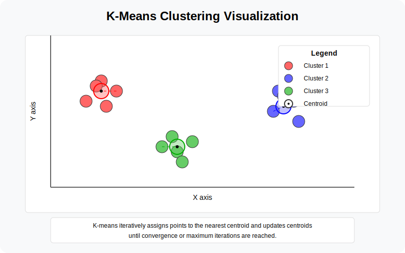
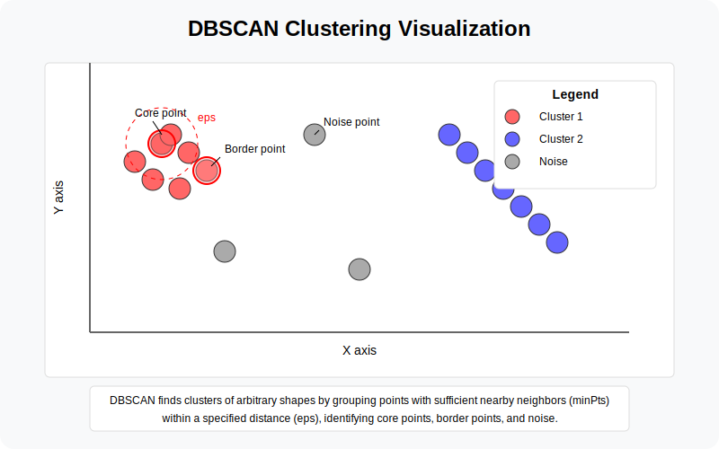
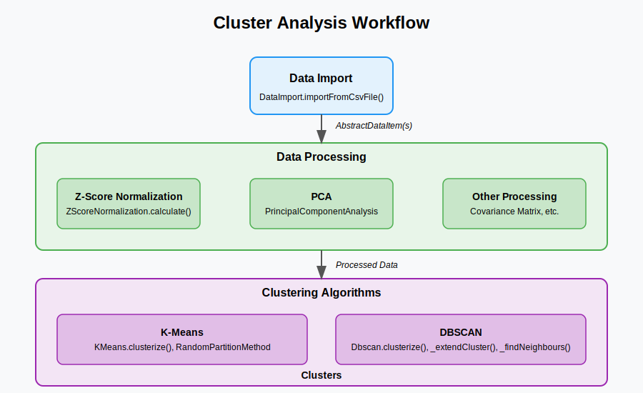

[](https://szysz3.github.io/cluster_analysis/)
# cluster_analysis
Cluster analysis playground. Set of algorithms and tools implemented just for fun (and learning purposes).

## What's inside

### K-means Clustering Algorithm

1. Partitioning-based method that divides data into k clusters
2. Uses squared Euclidean distance by default, but supports custom similarity measures
3. Implements random partition method for centroid initialization
4. Iteratively assigns data points to the nearest centroid and recalculates centroids



### DBSCAN Algorithm

1. Density-based clustering that can discover clusters of arbitrary shapes
2. Identifies core points, border points, and noise points
3. Works well with clusters of irregular shapes and varying densities
4. Configurable with minPts (minimum points) and eps (epsilon) parameters



### Tools

1. Principal Component Analysis (PCA) for dimensionality reduction
2. Z-Score normalization for data standardization
3. CSV data import capabilities
4. Covariance matrix calculation

## Clustering workflow



## Unit tests

Execute in main project dir (where pubpsec.yaml is located).

#### Install dependencies:

##### coverage:

```
dart pub global activate coverage
```

##### lcov:

```
brew install lcov
```
or
```
apt-get install lcov
```

#### Run unit tests with coverage:

```
./scripts/run_coverage.sh 
```
